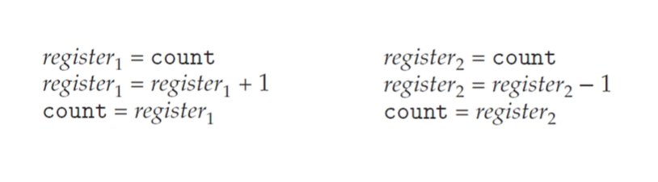
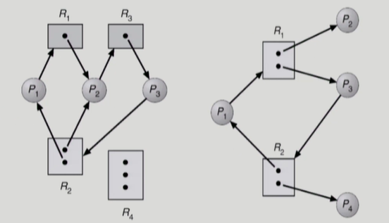
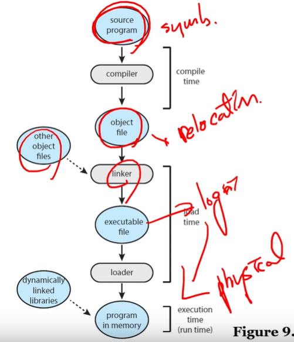
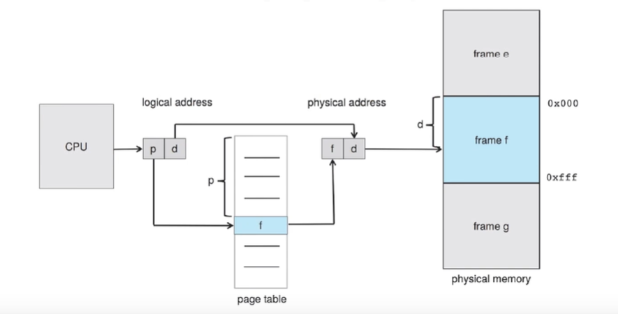
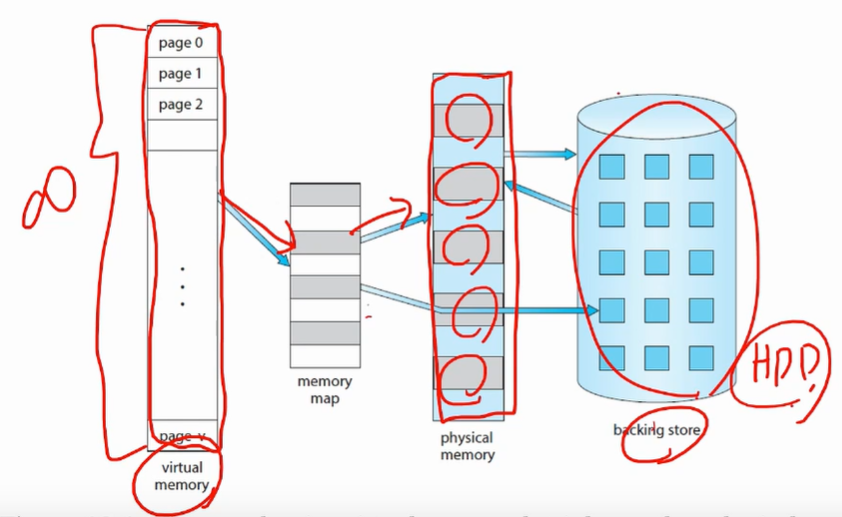
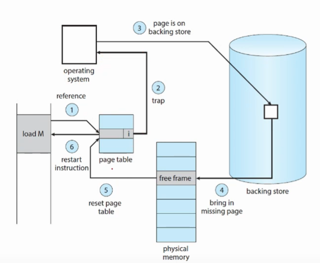
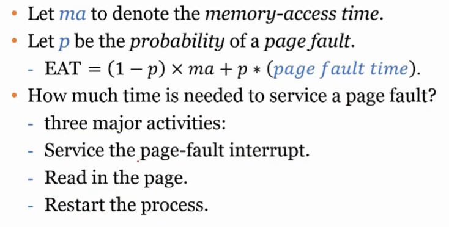
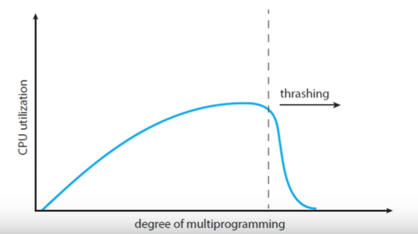
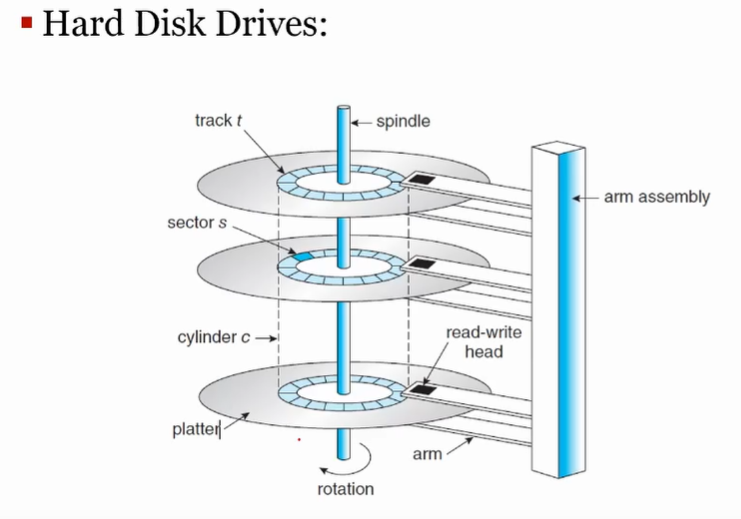
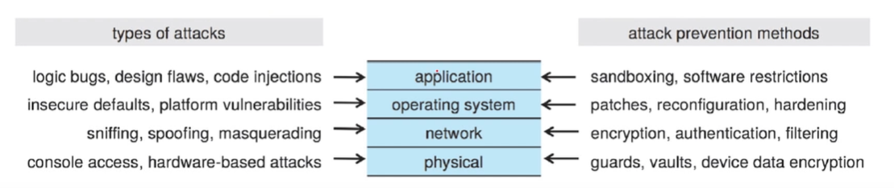

# OS-2021-1
## 1. What is operating system?
### Computer
정보를 처리하는 기계

### A stored-program computer(von Neumann architecture)
메모리에 program(set of instructions)을 저장하고 CPU에서 순차적으로 처리(fetch-execute)

### OS
컴퓨터 시스템을 운영하는 소프트웨어   
컴퓨터에서 항상 실행되고 있는 프로그램   
OS kernel이 기능의 핵심   
하드웨어와 application program, user간의 interface   
- User interface - CLI(shell), GUI
- Application programming interface - system call

Application program에게 system service 제공   
User가 시스템에 대해 알지 못해도 됨   
Ex) program execution, I/O operation, memory management, file system..

### Multiprogramming
Memory에 여러 개의 process을 올려놓음(I/O operation동안 다른 process 실행)

### Multiprocessing
여러 개의 processor가 process를 병렬 처리

### Time sharing
다른 process로 CPU core를 매우 빠르게 교체하여 동시에 처리하는 것처럼 보이게 함

### CPU scheduling
CPU가 준비 상태에 있는 process 중 어떤 것을 실행시킬지 선택

### Dual mode operation
user mode & kernel mode   
Kernel mode에서만 하드웨어를 직접적으로 제어할 수 있게 함으로써 프로그램의 잘못된 동작 방지   

---
## 2. Processes
### Process
실행 중인 프로그램   
HDD에 있는 프로그램이 메모리에 load된 상태

### Memory 영역
- text: 실행 가능한 코드   
- data: 전역 변수   
  - initialized data
  - uninitialized data
- heap: 동적 할당   
- stack: 함수 관련(parameter, return address, local variables)   

### Process states
- new: 생성된 상태(fork)
- ready: CPU에 할당될 준비가 완료된 상태
- running: 실행 중인 상태(CPU 점유), time interrupt 시 ready 상태로
- waiting: 아직 끝나지 않고 다른 일이 끝날 때 까지 기다리는 상태(ex. I/O completion)
- terminated: 실행 종료된 상태

### PCB(Process Control Block)
일종의 구조체  
Process에 관한 정보 포함 - process state, program counter(fetch할 memory 주소), CPU, memory..

### Multithreading
Process가 여러 개의 threads of execution를 가질 수 있게 함

### Context switch
context - PCB에 나타남   
Interrupt가 발생하면 현재 실행중인 process의 context를 저장하고, 다른 process로 CPU core switch(PCB정보를 CPU register(PC)에 load)

### Linux process operation
- fork() system call을 통해 process 생성
- child process는 parent process의 주소 공간을 복사해서 사용
- fork()의 return code가 0이면 child process
- child의 nonzero pid가 parent process로 return됨

## Process간 통신
### IPC(Inter-Process Communication)
동시에 실행되는 process에는 서로 데이터를 공유하지 않는 independent process와 서로 데이터를 공유하는 cooperating process가 존재   
데이터를 교환하기 위해선 IPC mechanism이 요구됨   
shared memory, message passing 두가지 모델이 존재

### Shared memory system
Producer-Consumer problem(producer는 정보 제공, consumer는 정보 소비)에서 producer는 buffer를 채우고, consumer는 buffer를 비우면서 하나의 buffer를 공유 -> 동시에 실행   
메모리 영역에 접근하는 코드를 application programmer가 작성해야함   
Ex) POSIX

### Message Passing
운영체제가 shared memory 관리(system call) - send(), receive()  
메세지를 주고 받는 communication link 필요
- direct communication   
정보를 주거나 받을 대상을 명시해야 함   
두 process간의 하나의 link가 생성됨
- indirect communication   
메세지가 port(mailbox)를 통해 전달됨   
port에 메세지를 넣고, 가져가는 방식   
두 개 이상의 process가 port 공유 가능
- synchronous(blocking) communication   
메세지를 다 보내지 못하거나 받지 못하면 process가 중단됨
- asynchronous(non-blocking) communication   
메세지를 다 보내지 못하거나 받지 못해도 process 그대로 진행   
정상적으로 전송됐는지, 받았는지 확인할 수 없지만 더 빠름   
Ex) Pipes

### Communication in Client-Server systems
서로 다른 PC의 process 간 통신   
(IPC - 하나의 PC 내의 process 간 통신)
- Socket   
pipe 형태로 원격의 두 컴퓨터 연결   
각 컴퓨터를 IP 주소로 특정하고 두 컴퓨터 간 pipe를 port로 특정(통신의 endpoints)   
Socket = IP:port
- RPC(Remote Procedure Call)   
네트워크로 연결된 시스템의 process 간 procedure call 추상화   
원격지의 함수 호출

---
## 3. Thread & Concurrency
### Multithreading
Thread: light weight process
CPU가 실행하는 단위가 process -> thread  
Thread 별로 다른 program counter, register set, stack 정보를 가지고, 같은 code, data, file 정보를 가짐   
장점   
- Responsiveness   
Process가 다 실행되지 못하고 block 됐을 때, thread를 추가하고 실행을 계속할 수 있음
- Resource sharing   
Thread는 process의 resource를 공유하므로 통신에 용이
- Economy   
Process를 추가하는 것보다 thread를 추가하는게 경제적임(context switching-thread switching)
- Scalability   
Multiprocessor architecture를 활용하기 좋음

### Multicore system
- single core: time sharing을 통해 concurrent하게 실행
- multi core: 병렬 처리   
어떤 task를 나누고 어떻게 나눌 것인지가 중요

### Multithreading Models
- user thread: user mode에서 사용하는 thread - kernel support x
- kernel thread: kernel mode에서 사용하는 thread - 운영체제가 직접 관리

user thread - kernel thread -> 1:1, 1:M, M:N 관계 존재

### Implicit Threading
Concurrent & parallel application(multithreading in multicore system)을 개발하는게 쉽지 않음
-> compiler나 run-time library가 대신 하도록 함   
Ex) Thread Pool, Fork & Join, OpenMP, GCD

---
## 4. CPU Scheduling
### CPU Scheduling
목적   
- CPU utilization 향상
- Throughput 향상   
단위 시간 동안 완료한 process 수
- Turnaround time 최소화   
process 도착 ~ 완료 시간
- Waiting time 최소화   
process가 ready queue에서 대기하는 시간의 합
- Response time 최소화     
사용자 응답 시간

용도   
context switching을 통해 여러 개의 process를 concurrent하게 처리
- CPU burst time: CPU 사용 시간 -> running 상태
- I/O burst time: I/O 대기 시간 -> waiting, ready 상태   
=> 일반적으로 I/O burst time이 더 많음
- CPU-bound: CPU burst time이 많은 process
- I/O-bound: I/O burst time이 많은 process

CPU Scheduler가 memory에 있는 ready 상태의 process 중 CPU를 할당할 process 선택   
**How?**
- Preemptive(선점형)   
scheduler가 process를 교체할 수 있음
- Non-preemptive(비선점형)   
process가 스스로 끝날 때까지 유지

**When?**
1. running -> waiting
2. running -> ready
3. waiting -> ready
4. terminate   

1, 4 -> 항상 non-preemptive

### Dispatcher
CPU core의 소유권을 넘겨주는(context switching) 모듈   
=> process 선택은 scheduler, 교체는 dispatcher
user mode switching, user program을 resume하기 위한 적절한 위치로의 jump 기능
dispatcher latency: process를 교체하는데 드는 시간

## Scheduling Algorithms
Ready queue에 있는 process 중 어떤 process에 CPU core를 할당할 것인지 결정
### FCFS(First Come First Served)
먼저 온 것 먼저 실행(non-preemptive)   
queue를 이용하여 CPU에 먼저 요청한 process에 먼저 할당   
CPU-burst time에 따라 waiting time이 크게 달라져 잘 사용하지 않음

### SJF(Shortest Job First)
가장 짧은 job 먼저 실행   
CPU-burst time이 같으면 FCFS로 결정   
waiting time을 최소화하기 때문에 optimal 일 수 있음   
But, 다음 CPU burst time을 알 방법이 없음   
-> 해당 process의 이전 CPU burst time을 통해 예측   
preemptive, non-preemptive 둘 다 가능   
Ex) 10만큼 소요되는 process(p1)가 5만큼 실행됐을 때 1만큼 소요되는 process(p2)가 새로 도착   
p1 마저 실행 -> non-preemptive   
중단하고 p2 먼저 실행 -> preemptive

### SRTF(Shortest Remaining Time First)
Preemptive SJF scheduling   
남은 시간이 가장 짧은 것 먼저 실행   
현재 실행 중인 process의 남은 시간보다 burst time이 적은 process가 도착하면 새로운 process로 선점   
SJF보다 waiting time 단축

### RR(Round-Robin)
preemptive FCFS with time quantum(작은 단위 시간)   
-> time quantum만큼 실행되면 interrupt를 일으켜 process 변경(context switch)   
circular queue를 이용한 time sharing 방식   
-> 덜 끝난 process는 ready queue의 tail로 보내짐   
적절한 time quantum을 잡는 것이 중요   
average waiting time은 SJF보다 약간 더 길다

### Priority-based
time sharing 방식에서 우선순위 부여   
우선순위가 같으면 FCFS로 결정   
SJF - 우선순위가 CPU burst의 역   
우선순위가 작은 process는 영원히 실행되지 못하는 경우 발생(starvation)   
-> 오랫동안 waiting하고 있는 process의 우선순위를 점진적으로 높여줌   
**RR + Priority scheduling**   
우선순위가 높은 process를 먼저 실행하되, 우선순위가 같을 경우 RR로 결정

### MLQ(Multi Level Queue)
ready queue를 분리하여 각각에 우선순위 부여   
우선순위가 높은 ready queue의 process들을 모두 실행하면 다음 우선순위의 ready queue의 process들 실행   
real-time process -> system process -> interactive process(UI) -> batch process   

### MLFQ(Multi Level Feedback Queue)
우선순위가 높은 ready queue는 quantum을 짧게 주고, 우선순위가 작을수록 quantum을 많이줌   

### Thread Scheduling
현대 OS에서는 process scheduling을 하지 않고 thread scheduling함(kernel thread)   
user thread는 thread library가 관리

### Real-Time CPU Scheduling
Real-Time(실시간) OS에서의 scheduling   
- Soft Realtime   
real-time process가 반드시 deadline내에 실행되어야 하지는 않지만, 우선순위는 존재
- Hard Realtime   
task가 반드시 deadline내에 실행되어야 함

---
## 5. Process Synchronization
Cooperating process들이 공유 데이터에 동시에 접근할 때 data inconsistency 발생 가능   
-> 순서 보장 필요   
- concurrent execution   
interrupt에 의해 context switch가 일어나 다른 process에 CPU core 할당
- parallel execution
분리된 CPU core에 의해 여러 process가 실행됨   

Ex) producer-consumer problem   
두개의 process가 buffer를 이용하여 asynchronously(동작을 맞추지 않음)하게 실행되며 데이터 공유

count++, count--

count에 5가 저장되어야 하지만 경우에 따라 4, 5, 6이 저장됨

### Race Condition(경쟁 상황)
여러 processes(threads) 간 공유 데이터로의 접근 순서에 따라 실행 결과가 달라지는 상황   
이를 방지하기 위해서 process(thread) synchronization이 필요

### Critical Section Problem(임계 영역 문제)
각 process의 코드 영역 중 공유 데이터에 접근하는 코드 영역(code segment)    
코드 영역은 크게 4가지로 나뉨
- entry section: critical section에 진입하기 위한 허가 요청 영역
- critical section
- exit section: critical section에서 나오는 영역
- remainder section

### Mutual Exclusion(상호 배제)
한 process가 critical section을 실행하고 있으면, 다른 process들은 critical section을 실행할 수 없음   
-> race condition 방지(Synchronization)

### Progress
deadlock 방지   
critical section을 실행하고 있는 process가 없으면, critical section에 진입할 다음 process를 선택하는 것이 지연돼서는 안됨

### Bounded Waiting
starvation 방지   
critical section에 진입할 수 있는 시간을 한정하여 다른 process들의 critical section이 영원히 실행되지 못하는 것 방지

## SW Solutions
### Peterson Algorithm
아키텍처에 따라 제대로 동작하지 않을 수 있음   
mutual exclusion, progress, bounded waiting 증명 가능

## HW Solutions
Critical-section problem 해결을 위해 hardware instruction 제공
### Atomic Operation
더이상 나눌 수 없는 operation 단위(1clock에 실행)   
Atomic instruction을 만들어 문제 해결   
-> interrupt 불가 -> mutual exclusion 보장   
Ex) test_and_set(), compare_and_swap()
이를 이용하여 atomic variable 생성

## OS Solution
### Semaphore
P(), V()라는 atomic operation으로만 접근 가능한 정수형 변수   
-> OS가 전체 operation이 한 instruction cycle에 수행되도록 보장

Semaphore(S)가 0이면 critical section을 실행 중인 process가 있고, 1이면 없다는 의미   
-> mutual exclusion 보장

But, multi processor 시스템에서만 사용 가능(parallel execution)

## Language-Level Solution
SW, HW, OS Solution -> Low-level mechanism => 사용하기 어려움, error 발생 확률 높음   
Language-Level Solution -> High-level Mechanism => 프로그래밍 언어 단에서 해결
### Monitor
최대 하나의 process만 접근할 수 있는 공유 데이터와 critical section의 집합   
구조
- entry queue: 모니터 내 함수 수만큼 존재
- condition queue: 특정 이벤트를 기다리는 process가 대기
- signaler queue: 신호 제공을 위한(signal 명령을 실행한) process가 임시 대기

특징
- mutual exclusion: 모니터 내에는 하나의 process만 진입 가능
- information hiding: 공유 데이터는 모니터 내의 process만 접근 가능

모니터 내에 자원을 요청하는 function, 자원을 반납하는 function 존재   
자원을 할당 받을 수 있을 때를 기다리는 condition queue에 signaler queue에서 신호 제공

과정
1. 처음 도착한 process(p1)가 자원 요청
2. 자원이 p1에 할당되고 p1이 모니터에서 나감
3. p2, p3가 요청을 위한 entry queue에 도착
4. p2가 모니터에 들어와 자원 요청
5. 하지만 모니터에 자원이 없으므로 condition queue로 이동
6. p1이 자원 사용을 끝내고 반납을 위한 entry queue에 도착
7. p1이 모니터에 들어와 자원 반납
8. p1이 signaler queue로 이동 후 condition queue에 신호 전달
9. p2가 모니터에 들어와 자원 할당 받은 후 나감
10. p1이 다시 모니터에 들어와 남은 일을 수행하고 나감

장점
- 사용이 쉬움
- error 발생 가능성 낮음(ex.deadlock)

단점
- 지원하는 언어에서만 사용 가능
- 컴파일러가 OS를 이해해야 함

---
## 6. Deadlock
### 정의
Process들이 서로가 가진 자원을 기다리며 block된 상태   
각자 일부 자원을 가지고 있는 상태에서 상대방의 자원을 요구할 때 발생   

### Resource
하드웨어, 소프트웨어를 포함하는 개념   
Ex) I/O device, CPU cycle, memory space   
**Process의 자원 사용 절차**   
Request -> Allocate -> Use -> Release   

### 발생 조건
- Mutual exclusion(상호배제)   
매 순간 하나의 process만이 자원 사용 가능
- Non-preemption(비선점)   
process의 자원을 강제로 빼앗지 못함
- Hold and wait(보유대기)   
자원을 가진 process가 추가 자원을 얻기 위해 자원을 계속 가지고 있음   
- Circular wait(순환대기)   
process 서로의 자원을 기다리는 사이클이 형성됨

### Resource-Allocation Graph(자원 할당 그래프)
Deadlock 확인 방법  
P: process   
R: resource   
P -> R: request edge   
R -> P: assignment edge

1 -> deadlock   
2 -> deadlock x
- 그래프에 cycle(화살표를 따라 시작으로 돌아옴)이 없으면 deadlock이 아님
- 그래프에 cycle이 있고, cycle에 포함된 resource에 하나의 instance만 있으면 deadlock

### 처리 방법
방지   
- Deadlock Prevention   
자원 할당 시 deadlock의 4가지 필요 조건 중 하나를 차단   
But 여러 제약 조건으로 자원 이용률(utilization), 성능(throughput) 저하
- Deadlock Avoidance   
Deadlock의 가능성이 없는 경우에만 자원 할당   
Process가 시작될 때 해당 process가 평생 쓸 자원의 양을 파악하여 deadlock 가능성 파악 후 자원 할당 결정   
-> process가 추가로 필요한 최대(평생 쓸) 자원의 양이 가용 자원보다 많으면 할당하지 않고, 자원 반납을 통해 가용 자원이 추가되면 다시 확인   
=> 최악의 상황을 고려   
Ex) Banker's Algorithm

처리   
- Deadlock Detection and Recovery   
Deadlock 발생은 허용하되 발견 시 recover   
Banker's Algorithm을 낙관적으로 사용하여 detection   
=> 최선의 상황을 고려    
Deadlock에 연루된 process들을 모두 종료시키거나, 하나씩 자원을 빼앗아서 recover
- Deadlock Ignorance   
Deadlock을 시스템이 책임지지 않음   
Deadlock은 빈번히 발생하는 것이 아니기 떄문에 미연에 방지하기 위해 조치를 취하는 것이 더 많은 overhead 발생시킴 -> 대부분 이 방식 사용

## 7. Memory Management
### Main Memory
주소를 가지는 byte 단위의 array로 구성됨   
CPU는 program counter를 이용하여 memory에서 instruction fetch   
base register와 limit register를 이용하여 접근 주소 범위 결정

### Address binding
Program은 binary file로 디스크에 저장되어 있음   
Program을 실행시키기 위해선 memory로 가져와야됨 -> process   

Logical address: CPU에서 사용하는 user program의 주소   
Physical address: memory의 주소   

**MMU(Memory Management Unit)**   
logical address를 physical address로 매핑하는 하드웨어

### Dynamic Loading
전체 program을 memory에 저장하는게 아니라 호출될 때만 load   
-> memory 공간 utilization 향상

### DLL(Dynamically Linked Libraries)
User program이 실행될 때 link되는 system library   
Main memory에 하나의 DLL instance만 존재 -> 여러 user process끼리 공유

## Memory Allocation
### Contiguous Memory Allocation
Process를 통채로 memory에 할당   
다른 process가 할당된 영역과 연속적으로 존재

### Variable-Partition scheme
가장 간단한 contiguous memory allocation 방식   
Process마다 다른 크기의 memory partition 할당   
각 partition에는 하나의 process만 존재하기 때문에 process가 바뀌면서 hole 발생   
해결 방법   
- First-Fit: 크기가 충분한 첫번째 hole에 할당
- Best-Fit: 크기가 충분하고 가장 작은 hole에 할당
- Worst-Fit 가장 큰 hole에 할당

**Fragmentation**
- External fragmentation   
Memory가 작은 크기의 여러 hole로 쪼개져, 전체 남은 공간은 많지만 연속적인 공간이 부족하여 할당할 수 없는 문제
- Internal fragmentation   
Process 크기가 애매하여 partition내의 사용되지 않는 memory 발생 문제

### Paging
Process의 physical address space가 non-contiguous함   
Physical memory를 고정된 크기의 block(frames), logical memory를 같은 크기의 black(pages)로 쪼갬   
Logical address = page number + page offset   
Page table을 통해 page number로부터 frame number를 찾음

### PTBR(page-table base register)
Page table은 memory에 두고, CPU의 PTBR을 이용하여 page table을 가리킴   
Context switching을 빠르지만, memory 접근 속도가 느림

### TLB(Translation Look-aside Buffer)
Cache memory 하드웨어를 통해 접근   
Page number가 TLB에 있으면 TLB hit, 없으면 TLB miss   
Hit ratio: TLB hit 비율

### Memory Protection
Valid-invalid bit   
page table의 각 entry에 포함   
연관된 page가 process의 logical address space에 있는지 확인

### Page table structure
Logical address space가 점차 커짐에 따라 page table도 커져야됨
- Hierarchical Paging   
Logical address space를 여러 table로 쪼갬
- Hashed Page Table   
Hash table을 이용하여 virtual page number 관리
- Inverted Page Table   
Logical address에 pid 추가

### Swapping
Backing store를 이용하여 process를 memory에서 꺼냈다 넣었다 함(swap)   
Process들의 전체 physical address space가 실제 physical memory를 초과할 수 있게 함   
오늘날에는 Swapping + paging 합쳐서 사용

## 8. Virtual Memory
메모리에 완전히 올라가지 않은 process를 실행할 수 있게 하는 기술   
-> program이 physical memory보다 커도 됨

virtual memory와 physical memory를 매핑하고, 실제 memory에 loading되지 않는 page들은 backing store(ex.HDD)에 저장   
**Page sharing을** 통해 file과 memory 공유가 쉬워짐

### Demand Paging
Page를 요청할 때만 memory에 올림   
Memory에 page가 없어도 process 실행 가능   
Process가 실행 중일 때는 memory에 있거나 secondary storage에 존재   
이를 구분하기 위해서 valid-invalid bit scheme 사용
- valid: page가 legal하고 memory에 존재
- invalid: page가 valid하지 않거나 secondary storage에 존재

### Page Fault
메모리에 loading이 안된 page에 접근했을 때 발생   
**Handling Procedure**   
1. Valid인지 invalid인지 구분하기 위해 internal table 체크
2. valid -> terminate, valid이지만 page fault -> page in
3. memory의 빈 영역인 free frame 찾음
4. secondary storage에서 desired page를 읽어서 새로운 frame에 할당
5. Page가 valid하다는 것을 나타내기 위해 internal table과 page table 수정
6. Restart instruction

### Locality of Reference(참조 국부성)
Program이 각 instruction마다 몇개의 새로운 page에 접근 -> instruction마다 multiple page faults 발생 가능   
But 실제로 잘 발생하지 않고, program은 참조 국부성을 가지려 하기 때문에 demand paging을 통해 좋은 performance를 가져옴   
Ex) Code와 data는 균일하게 access되지 않고 주로 특정 부분만 access됨   
-> demand paging을 통해 page fault를 줄이고 system performance를 향상시킬 수 있음   

### Hardware support
- page table   
vaild 또는 invalid 마킹
- secondary memory(swap space)   
memory에 존재하지 않는 page를 가지고 있음   
Ex) SSD, HDD

### Instruction Restart
Page fault 이후 process의 같은 공간, 상태에서 instruction 재실행   
Page fault가 instruction fetch 단계에서 발생하면 다시 fetch

### Free Frame List
Page fault가 발생했을 때, desired page를 secondary storage에서 memory로 가져오려면 free frame을 알아야 함   
Linked list로 구성된 free frame list 이용

### Demand Paging Performance
**Effective access time**

대부분 read하는데 시간 소비

## Page Replacement
Free frame이 없을 경우, 현재 사용하지 않는 frame 하나를 비움(secondary storage로)   
해당 content를 swap space에 write하고 해당 page를 invalid로 page table 수정

Algorithm - page fault 수를 최소화하는 것이 중요

### FIFO Page replacement
가장 오래된 page를 먼저 교체   
**Belady's Anomaly**   
일반적으로 frame이 많을수록 page fault는 줄어들지만, 어느 지점에서 page fault가 늘어나는 현상

### Optimal Page replacement(OPT)
가장 오랜 기간 사용되지 않을 것 같은 page 교체   
가장 적은 page fault rate 보장   
Belady's anomaly를 겪지 않음   
But 예측이 필요하므로 다른 알고리즘과의 비교에 주로 사용됨

### LRU Page Replacement
**Least Recently Used**   
Page가 마지막으로 사용된 시간을 기록해놓고, 사용되지 않은 기간이 가장 긴 page 교체   
이를 위해 하드웨어 지원 필요 -> counter, stack
- Counter implementation   
Page가 참조될 때마다 counter 복사   
가장 작은 값을 가지는 page 교체
- Stack implementation   
Stack에 page number 저장   
중간에서 pop 가능   
Bottom에 있는 page 교체   
- Reference bit   
0으로 초기화된 상태에서 참조되면 1로 변경   
reference bit이 0인 것 교체

### Second-Chance Algorithm
FIFO 기반   
하지만 reference bit이 1이면 한번 더 기회를 주고 다음 FIFO page 선택

### Frame Allocation
- Equal   
모든 process에게 동일한 frame 공유
- Proprotional   
Process의 크기에 따라 다르게 할당

- Local   
자신에게 할당된 frame 중에서 선택
- Global   
System의 모든 frame 중에서 선택

### Thrashing
Process가 충분한 page를 가지지 않으면 page fault rate이 매우 높아짐   
빈번한 page in and out으로 인해 CPU utilization이 급격히 떨어지는 현상

**Working-Set Model**   
만약 page가 active하면 working set에 존재   
만약 더이상 사용되지 않으면 working set에서 제외   
Working set에 있는 것만 load => Thrashing 완화

## 9. Storage Management
### Mass-Storage
비휘발성 메모리, secondary storage system   
Ex) HDD, NVM   
magnetic tapes, optical disks, cloud storage => RAID system

### HDD Scheduling
**목표**   
access time(seek time) 최소화   
데이터 전송 bandwidth 최대화   

\* seek time   
device arm이 cylinder의 특정 sector를 찾아가는 데에 걸리는 시간   
\* disk bandwidth   
한번에 전송될 수 있는 bytes / 시간

### FIFO

### SCAN
disk arm이 디스크의 한 쪽 끝에서 시작하여 다른 쪽 끝으로 이동   

### C-SCAN
SCAN과 같지만 다른 쪽 끝에 가면 돌아올 때 요청을 수행하지 않고 시작점으로 바로 돌아옴   
cylinder를 circular list처럼 다룸

### Boot Block
전원이 연결되었을 때 컴퓨터를 구동시킴   
가장 먼저 실행되는 program인 bootstrap loader가 NVM flash memory(ROM)에 저장되어 있음

### RAID
Redundant Arrays of Independent Disks   
Disk-organization 기술 집합   
병렬 처리(striping)를 통해 data가 읽고 쓰여지는 비율 향상   
Redundant 정보가 mutiple device에 저장될 수 있기 때문에(mirroring) data storage의 reliability 향상 -> 정보 손실 방지

\* Parallelism   
multiple drives => transfer rate 향상

## I/O System
컴퓨터의 두 가지 주요 기능: I/O(UI), computing(CPU)   
OS는 I/O operation, I/O device를 관리

### Memory-Mapped I/O
Control register들이 processor의 주소 공간으로 매핑됨   
CPU는 표준 데이터 전송 instruction을 이용하여 physical memory에 매핑된 위치에 있는 device-control register 읽고 씀

### I/O types
- polling(busy waiting)   
status register를 busy bit이 clear될 때까지 반복하여 읽음
- interrupt   
CPU가 interrupt-request line이라는 wire를 가지고 있어 interrupt를 발견하면 ISR로 jump하여 interrupt 처리
- DMA(Direct Memory Access)   
programmed I/O를 사용하지 않음   
대용량 데이터 전송에 주로 사용

### Blocking vs Non-Blocking
- Blocking I/O   
Thread가 중단됨(running -> waiting)
- Non-Blocking I/O   
Thread를 중지시키지 않고 그대로 return
- Asynchronous system call   
Thread가 계속 실행됨

## File System
Data와 program에 접근하기 위한 online(logical) storage   
File, directory로 구성

### Access Method
- sequential access   
- direct access(random)

### Allocation Method
File에 공간을 어떻게 할당할 것인지   
- Contiguous Allocation   
각 file을 통째로 할당   
external fragmentation 발생
- Linked Allocation   
각 file을 storage block의 linked list로 연결   
Sequential-access file에만 효과적
- FAT(File Allocation Table)   
Table에 linked list의 index 저장
- Indexed Allocation   
Block의 pointer들을 index block에 저장

## 10. Security and Protection
### Security
정보의 integrity를 보호하기 위해 사용자 인증 보장
unauthorized access, malicious destruction, accidental introduction 등 으로부터 computer resource 보호

### Security Violation
- threat - accidental
- attack - intentional(malicious)

**Type**
- confidentiality
- integrity
- availability
- Theft of service
- Denial of service(Dos)

### Security Level
- physical
- network
- operating system
- application

### Program Threat
- Malware   
Code injection으로 computer system에 공격을 주는 소프트웨어   
Ex) Trojan horse, spyware, ransomware
- Viruses and Worms   
다른 program을 감염시키거나 network을 이용하여 퍼짐

### System and Network Threat
- sniffing   
숨어서 network traffic을 가로챔
- spoofing   
집단에 속해있는 것처럼 속이거나, 두 peer간 transaction을 가로챔
- Denial of Service   
정보를 훔치는 것을 목표로 하지 않고, 사용자들의 system 사용을 괴롭힘
- Port Scanning   
원래 공격 용도는 아니지만 취약점을 찾아내 악용될 수 있음

### Cryptography(암호화)
암호화를 통해 OS가 두 peer가 주고 받는 network message를 검증할 필요가 없게 함   
Key를 이용하여 암호화, 복호화 과정을 거침

**Encryption**   
Key를 가지고 있는 receiver만이 message를 읽을 수 있음 => ciphertext를 plaintext로 decrypt 가능
- symmetric: 암호화, 복호화에 같은 key 사용
- asymmetric: 암호화, 복호화에 다른 key 사용 -> public key, private key

### Authentication
Encryption이 receiver를 제한하는 것이라면, authentication은 sender를 제한   
Hash function을 사용하여 고정된 크기로 암호화하고 verificate(복호화x)   
전자 서명에 많이 사용

## Protection
OS로부터 권한을 부여받은 process만 resource를 사용하게 함   
사용자에게 system 접근에 대한 허가 제한

### Least Privileage
Process, user에게 최소한의 권한 부여(permission)

### Protection Method
- Access matrix: access control list에 접근 권한 포함
- Sandboxing: running process에서 할 수 있는 것 제한
- code Signing: program에 전자 서명 부여
